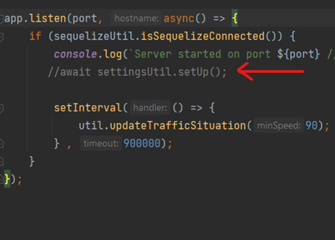

# MapApp

## Application description
Application, which may help delivery companies to plan routes around the World. 
The main focus of this app is to make route planning easier for the delivery companies, this is why in our app routing can be made by simply providing orders numbers, not just random street addresses. Then, based on given order information or more precisely on shipment and delivery addresses, applicatoin will calculate the best possible route. This route is optimized and addresses visiting order is taken into account, since shipment address should be visited first and only after that delivery.
The application also offer such a great additional settings as avoiding city centers option and taking into account real time traffic situation(Finland only).
The application uses different tools and engines for providing that functionality which are the Open route service(routing), Vroom project(optimization) and the Trafi API(traffic situation).

## Getting Started*
Before setting this application up, please get API keys for the following APIs:
- Openroute Service (free), https://openrouteservice.org/dev/#/signup
- Gas Prices API (not free starting from 08.06.2022), https://collectapi.com/api/gasPrice/gas-prices-api

After downloading the code, make the following steps:

- Run SQL script named DBCreationScript.sql (root folder) in your database console
- Create .env file in the root folder with the following fields (below given example values may be replaced with your own):
```
DATABASE=mapapp
DATABASE_DIALECT=mariadb
DATABASE_HOST=localhost
DATABASE_PORT=8081
DATABASE_USER=username
DATABASE_PASSWORD=password
ORS_API_KEY=your_Open_Route_Service_key
FUEL_API_KEY=your_Gas_Prices_API_key
```
- Optional: Add city center areas to the SettingsUtil.js file, read more in the Detailed instructions section. There are pre-added centers of Helsinki and Lahti cities only.
- Go to the index.js file (server folder) and uncomment the setUp() method

;
- Start the server with the console command node server/index.js
- Comment the setUp()-method back and restart the server.

*If you have problems with any of the steps above see detailed explanation in Wiki pages the Detailed instructions section.

## API short description*

1. Database related paths:

| Action | Path | Method |
| -------- | ---- | ----- |
| Create a new address | dao/address | POST |
| Read address by id | dao/address/read/:id | GET |
| Read all addresses | dao/address | GET | 
| Search for address | dao/address/search?city=Helsinki&street=Pohjoinen Rautatiekatu | GET |
| -------- | ---- | ----- |
| Create a new area | dao/area | POST |
| Create multiple new areas | dao/area/multiple | POST |
| Read area by name | dao/area/:areaName | GET |
| Read all areas | dao/area | GET |
| Update an area | dao/area/:areaName | PUT |
| -------- | ---- | ----- |
| Create a new client | dao/client | POST |
| Read a client by username | dao/client/:clientUsername | GET |
| Read all clients | dao/client | GET |
| Update client data | dao/client | PUT |
| -------- | ---- | ----- |
| Create a new manufacturer | dao/manufacturer | POST |
| Read a manufacturer by username | dao/manufacturer/:manufacturerUsername | GET |
| Read all manufacturer | dao/manufacturer | GET |
| Update manufacturer data | dao/manufacturer | PUT |
| -------- | ---- | ----- |
| Create a new data | dao/data | POST | { "name": "electricityPrice", "value": "3" } | "result": { "name": "electricityPrice", "value": "3" } |
| Read a data by name | dao/data/:name | GET |
| Read all data | dao/data | GET |
| -------- | ---- | ----- |
| Create a new order | dao/order | POST |
| Read order by order id | dao/order/:orderId | GET |
| Read all orders | dao/order | GET |
| Update an order | dao/order | PUT |
| Delete order by id | dao/order/:orderId | DELETE |

2. Routing related paths:

| Action | Path examples | Method |
| -------- | ---- | ----- |
| Search addresses by street address | api/v1/address/search?text=rantatie | GET |
| Addresses autocomplete | api/v1/address/autocomplete?text=ranta | GET |
| Search addresses by street address (GeoJSON output) | api/v1/address/geojson?text=rantatie | GET |
| Reverse geocode | api/v1/address/geocode?lon=24.94341806541326&lat=60.19201503975161 | GET |
| -------- | ---- | ----- |
| Calculate route by coordinates | api/v1/routing | POST |
| Calculate route by order ids | api/v1/routing/orders | POST |

*If you have questions or problems with some paths description, you can read more in wiki pages in the DAO classes and database description section or in the API detailed description section.

## Used technologies
1.	Openroute service routing engine, https://openrouteservice.org/
2.	Vroom project routing optimization, http://vroom-project.org/
3.	Open street map map, https://www.openstreetmap.org/about
4.	Leaflet and React leaflet map UI components https://leafletjs.com/  https://react-leaflet.js.org/
5.	Digitraffic API traffic situation, https://www.digitraffic.fi/en/road-traffic/
6.	Gas prices API gasoline and diesel prices, https://collectapi.com/api/gasPrice/gas-prices-api
7.	NodeJS and Express backend frameworks
8.	Sequelize ORM for JavaScript, https://sequelize.org/
9.	MariaDB database management system, https://mariadb.org/
10.	React frontend JavaScript library, https://reactjs.org/
11.	JavaScript main programming language
